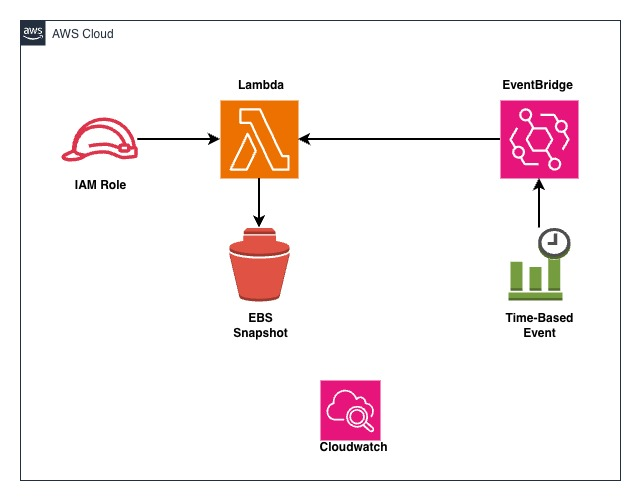

## AWS Cost Optimization using Event Driven Serverless Architecture

### Identifying and deleting stale Amazon EBS Snapshots

In this project, I have implemented an Amazon Lambda function that identifies EBS snapshots that are no longer associated with active EC2 instances and then deletes them to save on storage costs.

### Description

The Lambda function fetches all EBS snapshots owned by the same account ('self') and also retrieves a list of active EC2 instances (running and stopped). For each snapshot, it checks if the associated volume (if exists) is not associated with any active instance. If it finds a stale snapshot, it deletes it, effectively optimizing storage costs. For,
the Lambda function to work, it needs to be triggered by a scheduled event (e.g., EventBridge) to run at regular intervals (e.g., daily or weekly).

### Architectural Diagram
